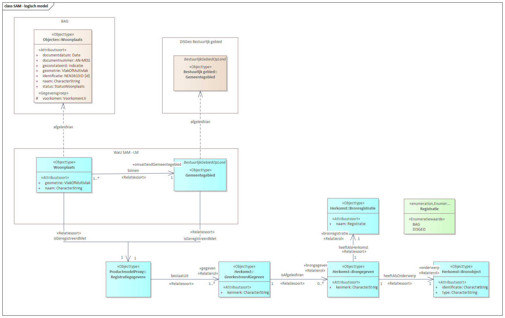
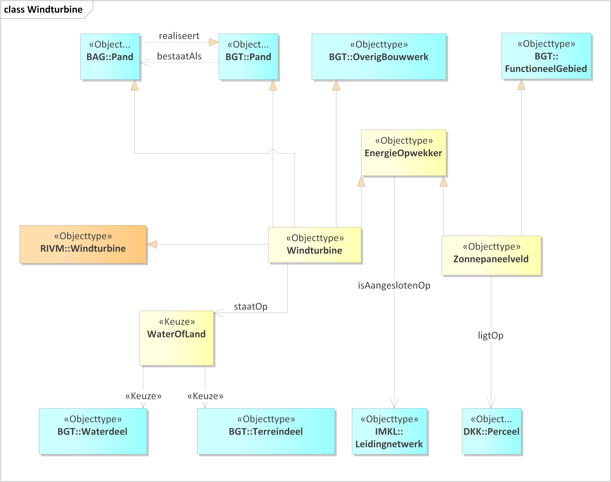
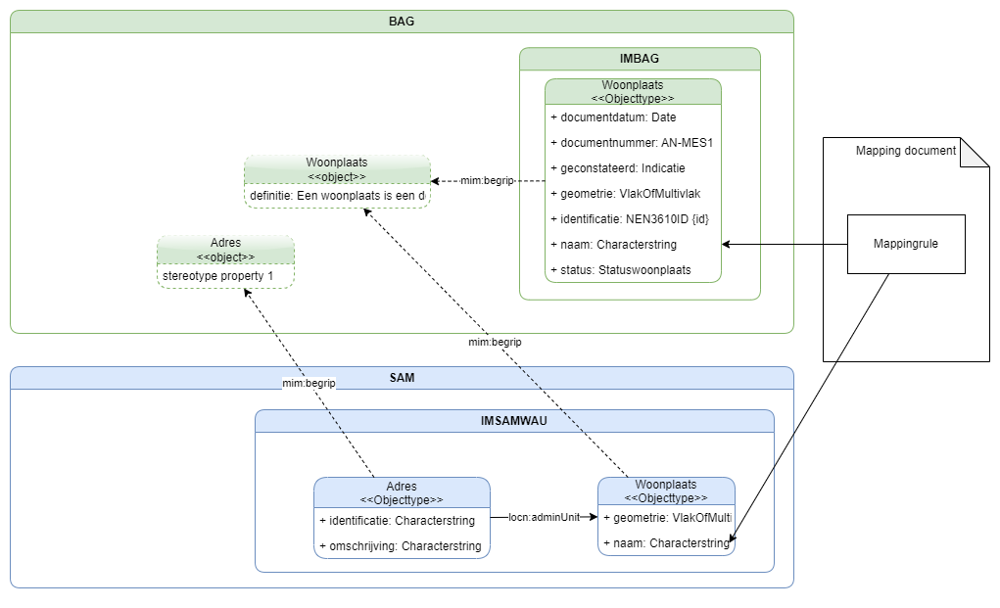

# Earlier modeling attempts

**Question**: How do we model, in the **IMX-Geo logical information model**, the missing relationships that we want to add between object types in source registries? 

Arnoud, Linda and Jesse each created a first attempt at modeling this. 

## Linda's model

In this model a WaU product model "IMX-Geo" is defined for the use case 'answer all questions' (the diagram is only showing a small part). In it, dependency relationships are used to express that the logical model IMX-Geo contains classes, which depend on (more specifically: are derived from) classes in source models. 

So e.g. IMX-Geo Woonplaats is derived from BAG `Woonplaats`. It does not inherit its attributes. And IMX-Geo `Gemeentegebied` is derived from a class with the same name in the source model DisGeo Bestuurlijke gebieden. 

IMX-Geo `Woonplaats` and `Gemeentegebied` also have the modeling pattern for specifying provenance on the data level. 

The special thing here is that IMX-Geo `Woonplaats` and `Gemeentegebied` have an association `binnen`. This is not present in the BAG or DiSGeo Bestuurlijke gebieden, but an addition owned by the IMX-Geo model. 

## Arnoud's model

In this model generalisation relationships are used to explain how classes that are needed on the product level are related to classes in source models. 

E.g. a new class `Windturbine` which is declared a subclass of BGT `Pand`.

It seems to be doable to script a translation from this model, which is strictly not a correct UML model, to a working OWL ontology + SHACL. The UML model provides a nice visualization, the generated OWL/SHACL would then be the "real", formal logical model. This would also allow us to use the UML editor as an OWL editor.

## Jesse's model

The IMX-Geo model is a product model requiring flexibility in terms of vocabulary and schema. It is a model tailored to specific user requirements but it is nonetheless based on the models (MIM-1 to 3) as defined in the source models. IMX-Geo does not change the meaning of source data but instead introduces a new view of the data, where data might be transformed or inferred. We want to exchange data about e.g. Woonplaats; but not redefine woonplaats.
In order to stay true to the original semantics the IMX-Geo product model links to the concepts defined in the respective contexts where possible. In some cases there might not be available concepts in the source context. Here new concepts must be defined. These should be matched to concepts in the respective contexts. 

