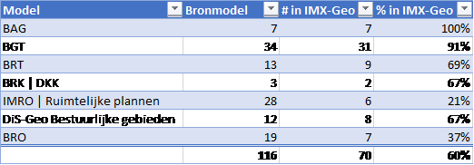

# IMX-Geo completeness analysis

Analysis of the completeness of the IMX-Geo model.

## Comparison to "stelselcatalogus clusterbegrippen"

The [Stelselcatalogus](https://www.stelselcatalogus.nl) provides insight into
the Dutch base registries / governmental data.

It is a collection of concepts that describe the governmental data that exists
within the different base registries. It also contains a short list of "[cluster
concepts](https://www.stelselcatalogus.nl/clusterbegrippen)", concepts that were
added to serve as entry points to the more detailed base registry concepts.

As part of the analysis, we compared the classes in IMX-Geo to the cluster
concepts in the Stelselcatalogus.

| Stelselcatalogus   | IMX-Geo              | Remarks                                                                                                                                                                                                |
|--------------------|----------------------|--------------------------------------------------------------------------------------------------------------------------------------------------------------------------------------------------------|
| Adres              | Adres                | Looks equivalent                                                                                                                                                                                       |
| Bouwwerk           | Bouwwerk             | In IMX-Geo this is a broader concept than in the stelselcatalogus. Gebouw is a narrower concept of Bouwwerk. This conflicts with the Stelselcatalogus definition.                                      |
| X                  | Gebouw               | Present in IMX-Geo because it is a concept in high demand and there is a lot of data about buildings. It makes sense in IMX-Geo to define it separately as Bouwwerk is too generic for many use cases. |
| Ondergrond         | Ondergrond           | Looks equivalent                                                                                                                                                                                       |
| Onroerende zaak    | X                    | IMX-Geo has the more specific concept Perceel.                                                                                                                                                         |
| X                  | Perceel              | See below for rationale                                                                                                                                                                                |
| Terrein            | Terrein              | The definitions / populations differ. IMX-Geo Terrain covers physical terrain and its function only.                                                                                                   |
| Water              | Water                | Looks equivalent                                                                                                                                                                                       |
| Weg                | Weg                  | Almost equivalent. IMX-Geo also relates this to Openbare Ruimte.                                                                                                                                       |
| X                  | Registratieve Ruimte | Possible addition for Stelselcatalogus. Defined in NEN3610.                                                                                                                                            |
| X                  | Beperking            | Source is BRK, so in scope for Stelselcatalogus, but maybe too detailed.                                                                                                                               |
| X                  | Grondwaterstand      | Narrower concept of Ondergrond                                                                                                                                                                         |
| X                  | Bodemsamenstelling   | Narrower concept of Ondergrond                                                                                                                                                                         |
| X                  | Bestemming           | Not in a base registry; out of scope for Stelselcatalogus                                                                                                                                              |
| X                  | Landschapselement    | Not in a base registry; present in IMX-Geo because of ideas to set up a registry for this.                                                                                                             |
| X                  | Spoorweg             | Narrower concept of Weg                                                                                                                                                                                |
| X                  | Bestuurlijk Gebied   | Narrower concept of Registratieve Ruimte                                                                                                                                                               |
| X                  | Provincie            | Narrower concept of Openbaar Lichaam (defined in DisGeo)                                                                                                                                               |
| X                  | Gemeente             | Narrower concept of Openbaar Lichaam (defined in DisGeo)                                                                                                                                               |
| X                  | Gemeentegebied       | Narrower concept of Bestuurlijk gebied                                                                                                                                                                 |
| X                  | Waterschap           | Narrower concept of Openbaar Lichaam                                                                                                                                                                   |
| X                  | Waterschapsgebied    | Narrower concept of Bestuurlijk gebied                                                                                                                                                                 |
| X                  | Veiligheidsregio     | Narrower concept of Openbaar Lichaam                                                                                                                                                                   |
| X                  | Buurt                | Too detailed as Cluster concept                                                                                                                                                                        |
| X                  | Wijk                 | Too detailed as Cluster concept                                                                                                                                                                        |
| X                  | Woonplaats           | Not a cluster concept; but note that in IMX-Geo this falls under Registratieve Ruimte, while in stelselcatalogus it falls under Terrein.                                                               |
| Locatie            | X                    | Too generic for IMX-Geo (see below)                                                                                                                                                                    |
| Aansprakelijkheid  | X                    | Not in scope IMX-Geo                                                                                                                                                                                   |
| Inkomen            | X                    | Not in scope IMX-Geo                                                                                                                                                                                   |
| Natuurlijk persoon | X                    | Not in scope IMX-Geo                                                                                                                                                                                   |
| Omzet              | X                    | Not in scope IMX-Geo                                                                                                                                                                                   |
| Organisatie        | X                    | Not in scope IMX-Geo                                                                                                                                                                                   |
| Roerende zaak      | X                    | Not in scope IMX-Geo                                                                                                                                                                                   |
| Vestiging          | X                    | Not in scope IMX-Geo                                                                                                                                                                                   |

**Adres**, **Bouwwerk**, **Ondergrond**, **Terrein**, **Water**, and **Weg**
match Cluster concepts pretty closely.

**Aansprakelijkheid**, **Inkomen**, **Locatie**, **Natuurlijk persoon**,
**Omzet**, **Organisatie**, **Roerende zaak**, and **Vestiging** are Cluster
concepts that don't match any class in IMX-Geo. This is okay; most of them are
not in scope for IMX-Geo, because they are not about spatial objects.

The Cluster concept **Locatie** is too generic to use in IMX-Geo; everything has
location in IMX-Geo so it doesn't make sense to have this class there.

**Perceel** in IMX-Geo falls under the Cluster concept Onroerende zaak. For now,
we only need Perceel, not the other subclasses of Onroerende Zaak
(Appartementsrecht and Leidingnetwerk) but it might be interesting to add those
later. If that's the case, it would be better to add the Onroerende Zaak class
to IMX-Geo instead.

IMX-Geo has quite a few concepts that don't match a Cluster concept. Several of
these classes are a bit more specific than the Cluster concepts are, so it makes
sense the are missing from the Cluster concepts in the Stelselcatalogus. Others,
like **Bestemming**, are not in scope for the stelselcatalogus, because the data
for these things is not in a base registry.

For **Bestuurlijk gebied** it could be argued that it should be a Cluster
concept - or its superclass in NEN 3610, [Registratieve
ruimte](http://definities.geostandaarden.nl/nen3610-2022/id/begrip/registratieve_ruimte).
**Gemeentegebied** and **Waterschapsgebied** would fall under this as well.
**Gemeente** and **Waterschap** are subclasses of [Openbaar
Lichaam](http://begrippen.geostandaarden.nl/disgeo/id/begrip/openbaar_lichaam)
(introduced in DisGeo but also in TOOI); this could also be a Cluster concept as
there is government data about these governmental organisations.

## Analysis of KKG and other use cases

We looked at Kadaster Knowledge Graph (KKG) use cases that were assembled in
earlier projects, as well as questions about datasets posed by users at the
Geoforum. Approximately 50% of these use cases was covered by IMX-Geo (at
analysis time, during the fourth high5 in May 2023).

Some highlights of this analysis:

-   Many questions used neighbourhoods (wijken/buurten)

-   A number of use cases needed data which is within scope of IMX-Geo, but was
    not yet included in the model: e.g. trees, wells, statusses, swimming pools,
    sports halls, terrain functions, playground equipment, publiekrechtelijke
    beperkingen.

-   A number of use cases needed data that was out of scope of IMX-Geo, such as
    risk objects, CBS kerncijfers, floor height.

As a result of this, Neighbourhood (buurt/wijk) was added as well as
Publiekrechtelijke beperking.

Details of this analysis are in [this
spreadsheet](https://github.com/Geonovum/IMX-Geo/blob/main/usecases/usecasedekkingsanalyse.xlsx).

## Discussions with stakeholders

We have had discussions with information model managers to retrieve use cases of
integrated use of geo-basic data.

The following conversations took place:

-   17.05.2023: BGT & DiS-Geo

-   26.05.2023: BAG

-   30.05.2023: BRO

-   31.05.2023: KLIC / IMKL

-   01.06.2023: BRK

-   08.05.2023: Ruimtelijke Plannen / IMRO

As a result of these conversations, we collected 21 use cases:

1.  Heat stress or flooding

2.  Locations of windmills at sea

3.  Where was I born?

4.  Urban or rural area

5.  Access to inheritances

6.  Street width for loading/unloading

7.  NL Alerts in the event of smoke development

8.  Risk of flooding

9.  Housing typing

10. Number of floors and entrance door

11. Energy labels

12. Home insulation, asbestos remediation and lead water pipes

13. Policy on housing (re)construction and vital neighbourhoods

14. Repressive object information

15. Influence of mining on the built environment

16. Salinization

17. Residential building locations

18. Realistic housing offer

19. Environmental label for houses

20. Digging area information

21. Drone locations

Details of this analysis are in [this
spreadsheet](https://github.com/Geonovum/IMX-Geo/blob/main/usecases/opgehaaldeusecases.xlsx).

## Comparison with source models

Finally, we compared the IMX-Geo model to the source models that are within
scope, to find any other classes we wanted to support.

When developing the IMX-Geo, we chose to only add those objects to the model
that are relevant to a certain use case. The IMX-Geo therefore only contains
those objects that are mentioned in a use case.

As a result of this, the IMX-Geo now contains **60%** of all objects/concepts
that appear in the source models. See table below.

BAG and BGT are almost fully supported. Because KLIC is recognized as a consumer
of data by means of the IMX-Geo, IMKL is not part of IMX-Geo anymore.

The IMX-Geo can grow over time and support more objects/concepts from source
models as the IMX-Geo is expanded based on new use cases, hitting new objects.

Details of this analysis are in [this
spreadsheet](https://github.com/Geonovum/IMX-Geo/blob/main/usecases/completenessimxgeo.xlsx).
