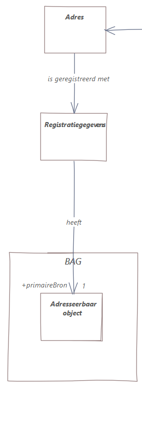
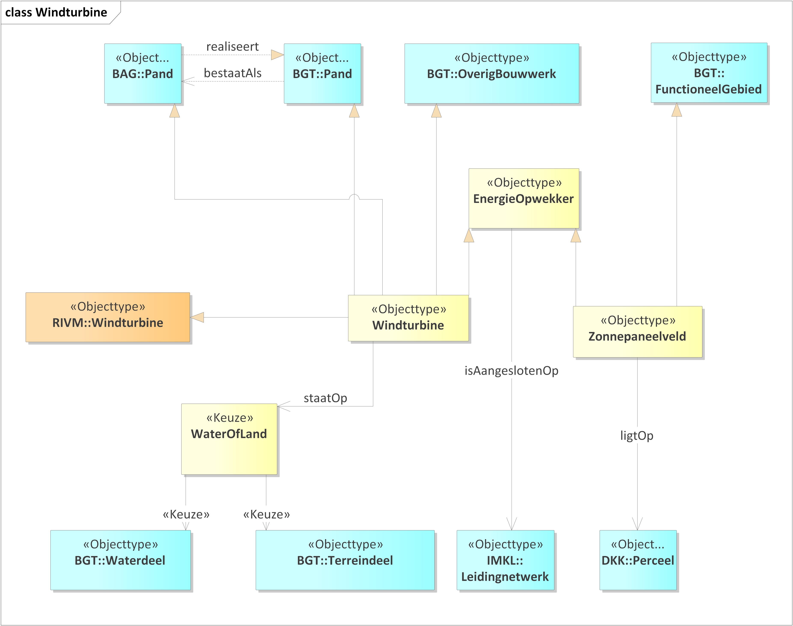
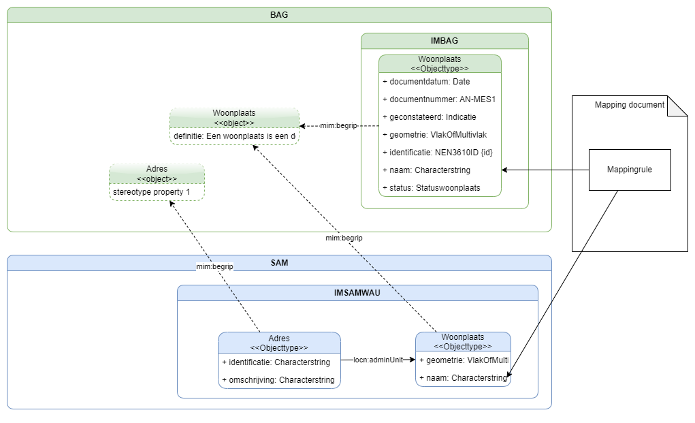

# Design of the overarching information model

We will create a concept scheme ([[MIM11]] level 1) in SKOS; a UML conceptual model (MIM level 2) and a UML logical model (MIM level 3):

- The SKOS concept scheme describes the concepts that play a role in our universe of discourse. 
- The conceptual model defines the classes of our universe of discourse.
- The logical model describes the shapes of the data. 

## Concept scheme

Design principles: 
1. The concept scheme is created in SKOS [[skos-reference]]. 
1. The SAM concept scheme contains only those concepts that play a role in the SAM universe of discourse but have not been coined elsewhere in the context of the Dutch base registries. I.e.: we only coin those concepts that do NOT have an exact match with an existing concept (again, in the context of the Dutch base registries). This saves work and maintenance. We will find out if this is workable.
1. We create the concept scheme manually, we do not generate it from a UML model. The reason is that we want to be able to link related concepts in ways not supported in UML (see next point). 
1. Concepts will have matching relationships (`broadMatch`, `narrowMatch`, `closeMatch`, `relatedMatch`) with existing concepts from the Dutch base registries where appropriate. Note: `exactMatch` is excluded (see point 2).
1. Both the conceptual and the logical model have annotations containing the uris of concepts from a Dutch base registry or from the SAM concept scheme. These are entered in the MIM metaproperty `begrip`. Every class and property has this metadata. 

<aside class="issue">A separate concept scheme, with terms in Dutch and English, must be created for the <a href="https://geonovum.github.io/WaU-LIN/">Lineage model</a>. The W3C PROV-ontology [[prov-o]] will be used as a starting point (although this is an ontology, not a concept scheme). </aside>

The work-in-progress version of the concept scheme can be viewed [[here]](https://begrippen.geostandaarden.nl/)(https://begrippen.geostandaarden.nl/sm/nl/). 

<aside class="example" id="ex-demolition">
The concept "sloopjaar" (@EN: demolition year) is coined in the SAM concept scheme, because it does not exist as such in the BAG base registry although buildings do get demolished. The BAG does, however, have a building status "demolished" which, using the change history of the BAG, makes it possible to derive the demolition year of the building. This is indicated with the <code>relatedMatch</code> property.

<pre>
@prefix bk: &lt;https://begrippen.geostandaarden.nl/sam/id/begrippenkader/> .
@prefix : &lt;https://begrippen.geostandaarden.nl/sam/id/begrip/> .
@prefix rdfs: &lt;http://www.w3.org/2000/01/rdf-schema#>.
@prefix skos: &lt;http://www.w3.org/2004/02/skos/core#>.

:sloopjaar
   a skos:Concept ;
   skos:definition "Het jaar dat de sloop van een gebouw is voltooid."@nl ;
   skos:prefLabel "sloopjaar"@nl ;
   rdfs:label "sloopjaar" ;
   skos:inScheme bk:WaU-SAM ;
   skos:relatedMatch &lt;http://bag.basisregistraties.overheid.nl/id/begrip/PandGesloopt> ;
.
</pre>
</aside>

<aside class="example" id="ex-concept">
The concept "bouwjaar" is already defined in the BAG concept scheme and is referenced from the conceptual SAM model. 

<figure>

<figcaption>Bouwjaar property in CM with reference to BAG concept</figcaption>
</figure>
</aside>

## Conceptual model

Design principles: 
1. The conceptual model will be a valid UML [[MIM11]] model  on MIM level 2, with the exception that we may define extensions of MIM if we need them.
1. The conceptual model defines the classes of our universe of discourse (see [scope]#introduction). It identifies the object types and their inherent propeties, including relationships with other objects. 
1. The conceptual model describes how the classes in our universe of discourse relate to each other. These relationships can cross the boundaries of individual base registries.
1. We relate all object types and properties to corresponding SKOS concepts as described in the previous section. 
1. In this conceptual model we will define relationships between objects if they are relevant for users, even though they may not be present in the source datasets (which were designed as silos).
1. We re-use object types from source registries by making copies of them. 
1. We model the relationships between object types in different source registries by adding these to the copied classes. More on these last two points below.

This preliminary, partial sketch of the conceptual model contains a few object types from BAG, BRK, and DiSGeo: 

An assumption is that we have access to the information models for all source datasets. These are created using modeling language UML. 

**Question**: How do we model the relationships between object types in source registries? We considered two options:  
- Create subclasses (UML specialisations) of the source classes and add the relationships between these subclasses. 
- Don't use the source models directly, but make copies of all object types that we need in the overarching model. We then add the relationships between these copy classes. 

We decided to go for the second option, at least in the conceptual model. In the case of subclasses, in the MIM paradigm we would 'inherit' all properties of the superclasses, while we want only a selection of relevant properties. Also, conceptually we are not creating subclasses. What we actually want is to derive data from source data. We will model the dependency of our object types from source object types on the logical level, because there we are considering data. On the conceptual level we are only considering objects. 

The conceptual model will be a 'product model' defining the objects in user friendly terms (satisfying requirements ,  and  ). 

## Logical model
Based on this conceptual model we will create a complete logical model, which defines the shapes of the data. On this level we add data-registration concepts like history and provenance. The logical model also specifies how orchestrated data is related to source data. This logical model satisfies requirements ,  and .

<aside class="note">This is a (very) simplified view of modeling the relation to source objects and probably not how we will  actually model it. </aside>

We are planning to introduce a generic modeling pattern on the MIM level (metamodel) for provenance that can be applied to describe how orchestrated data was created from source data. A first version of this was created as part of our first use case, [Adresses](https://geonovum.github.io/WaU-UC1/#EAID_18371C99_5129_4c39_8E20_83CED8FF19B9). This provenance or lineage information will also be available to users on request.

This leaves requirement , which we haven't figured out how to address yet on either the conceptual or logical level. 

**Question**: How do we model, in the **SAM logical information model**, the missing relationships that we want to add between object types in source registries? 

Arnoud and Linda each created a first attempt at modeling this. 

### Linda's model

In this model a WaU product model "SAM" is defined for the use case 'answer all questions' (the diagram is only showing a small part). In it, dependency relationships are used to express that the logical model SAM contains classes, which depend on (more specifically: are derived from) classes in source models. 

So e.g. WaU-SAM Woonplaats is derived from BAG `Woonplaats`. It does not inherit its attributes. And WaU-SAM `Gemeentegebied` is derived from a class with the same name in the source model DisGeo Bestuurlijke gebieden. 

WaU-SAM `Woonplaats` and `Gemeentegebied` also have the modeling pattern for specifying provenance on the data level. 

The special thing here is that WaU-SAM `Woonplaats` and `Gemeentegebied` have an association `binnen`. This is not present in the BAG or DiSGeo Bestuurlijke gebieden, but an addition owned by the WaU-SAM model. 

### Arnoud's model

In this model generalisation relationships are used to explain how classes that are needed on the product level are related to classes in source models. 

E.g. a new class `Windturbine` which is declared a subclass of BGT `Pand`.

It seems to be doable to script a translation from this model, which is strictly not a correct UML model, to a working OWL ontology + SHACL. The UML model provides a nice visualization, the generated OWL/SHACL would then be the "real", formal logical model. This would also allow us to use the UML editor as an OWL editor.

### Jesse's model

The SAM model is a product model requiring flexibility in terms of vocabulary and schema. It is a model tailored to specific user requirements but it is nonetheless based on the models (MIM-1 to 3) as defined in the source models. SAM does not change the meaning of source data but instead introduces a new projection of the data, where data might be transformed or inferred. We want to exchange data about e.g. Woonplaats; but not redefine woonplaats.
In order to stay true to the original semantics the SAM product model links to the concepts defined in the respective contexts where possible. In some cases there might not be available concepts in the source context. Here new concepts must be defined. These should be matched to concepts in the respective contexts. 

