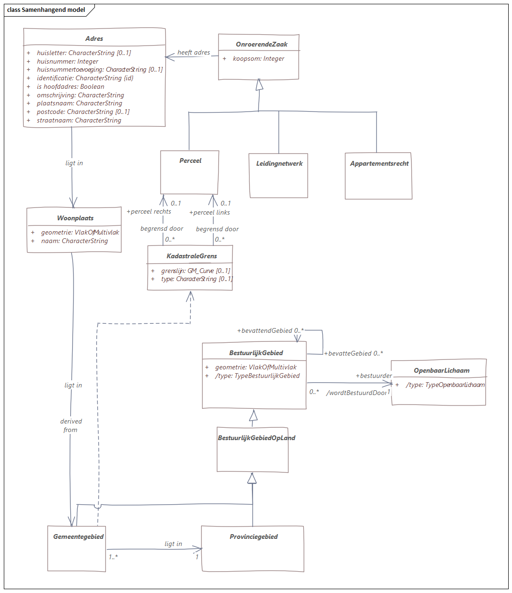
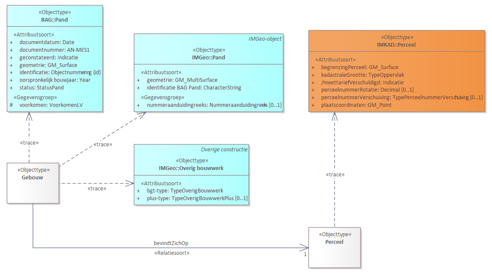

# Design of IMX-Geo

We will create a concept scheme ([[MIM11]] level 1) in SKOS; a UML conceptual model (MIM level 2) and a UML logical model (MIM level 3). In very general terms the roles of these models are:

- The SKOS [concept scheme](#concept-scheme) describes the concepts that play a role in our universe of discourse. 
- The [conceptual model](#conceptual-model) defines the classes of our universe of discourse.
- The [logical model](#logical-model) describes the shapes of the data and how the data is derived from the source registries.

The most important one is the logical model, which sits between the source registry models on the one hand, and on the other hand the product models that define what data is served to the users. 

## How does the model satisfy the requirements
-  - the model introduces classes that correspond to the common point of view of users. Mappings can be used to add user-friendly names for things. These names will also be added in SKOS (MIM level 1).
-  - the model is loosely coupled to the source classes and requires a mapping for each source class.
-  - the model shows how classes are related, including cross-registry relationships.
-  - the model introduces relationships between objects from different sources
-  - the model is loosely coupled to the source models using mappings.
-  - the model does contain links to the source classes to indicate which data is derived from which source class.
-  - the model is expressed in SKOS and MIM. MIM can be expressed UML but also in XML and RDF.
-  - the model is loosely coupled so changes in the source models do not directly impact it, unless changes include the addition or removal of classes. Mappings can be impacted by changes in properties, but the mappings are maintained outside of the model. 

## Concept scheme

The concept scheme is a MIM level 1 model and introduces user-friendly concepts to talk about the universe of discourse. 

Design principles: 
- The concept scheme is created in SKOS [[skos-reference]]. 
- The SAM concept scheme contains only those concepts that play a role in the SAM universe of discourse but have not been coined elsewhere in the context of the Dutch base registries. I.e.: we only coin those concepts that do NOT have an exact match with an existing concept (again, in the context of the Dutch base registries). This saves work and maintenance. We will find out if this is workable.
- We create the concept scheme manually, we do not generate it from a UML model. The reason is that we want to be able to link related concepts in ways not supported in UML (see next point). 
- Concepts will have matching relationships (`broadMatch`, `narrowMatch`, `closeMatch`, `relatedMatch`) with existing concepts from the Dutch base registries where appropriate. Note: `exactMatch` is excluded (see point 2).
- Both the conceptual and the logical model have annotations containing the uris of concepts from a Dutch base registry or from the SAM concept scheme. These are entered in the MIM metaproperty `begrip`. Every class and property has this metadata. 

<aside class="issue">A separate concept scheme, with terms in Dutch and English, must be created for the <a href="https://geonovum.github.io/WaU-LIN/">Lineage model</a>. The W3C PROV-ontology [[prov-o]] will be used as a starting point (although this is an ontology, not a concept scheme). </aside>

The work-in-progress version of the concept scheme can be viewed [[here]](https://begrippen.geostandaarden.nl/)(https://begrippen.geostandaarden.nl/sm/nl/). 

<aside class="example" id="ex-demolition">
The concept "sloopjaar" (@EN: demolition year) is coined in the SAM concept scheme, because it does not exist as such in the BAG base registry although buildings do get demolished. The BAG does, however, have a building status "demolished" which, using the change history of the BAG, makes it possible to derive the demolition year of the building. This is indicated with the <code>relatedMatch</code> property.

<pre>
@prefix bk: &lt;https://begrippen.geostandaarden.nl/sam/id/begrippenkader/> .
@prefix : &lt;https://begrippen.geostandaarden.nl/sam/id/begrip/> .
@prefix rdfs: &lt;http://www.w3.org/2000/01/rdf-schema#>.
@prefix skos: &lt;http://www.w3.org/2004/02/skos/core#>.

:sloopjaar
   a skos:Concept ;
   skos:definition "Het jaar dat de sloop van een gebouw is voltooid."@nl ;
   skos:prefLabel "sloopjaar"@nl ;
   rdfs:label "sloopjaar" ;
   skos:inScheme bk:WaU-SAM ;
   skos:relatedMatch &lt;http://bag.basisregistraties.overheid.nl/id/begrip/PandGesloopt> ;
.
</pre>
</aside>

<aside class="example" id="ex-concept">
The concept "bouwjaar" is already defined in the BAG concept scheme and is referenced from the conceptual SAM model. 

<figure>

<figcaption>Bouwjaar property in CM with reference to BAG concept</figcaption>
</figure>
</aside>

## Conceptual model

<aside class="issue">
TBD: rewrite this section. 

In this section, we list a set of design principles, and describe a first modeling attempt, but these may still change profoundly. We decided to focus on the logical level first, in order to see how it can play a role in the orchestration engine. Once we understand that, and create a first logical model that works, we will return to the conceptual model. We retain the old design principles and modeling attempt for now - they may or may not still be valid. 
</aside>

Conceptual modeling principles:
<ol>
   <li>The conceptual model will be a valid UML [[MIM11]] model  on MIM level 2, with the exception that we may define extensions of MIM if we need them.</li>
   <li>The conceptual model defines the classes of our universe of discourse (see <a href="introduction">scope</a>). It identifies the object types and their inherent properties, including relationships with other objects. </li>
   <li>The conceptual model describes how the classes in our universe of discourse relate to each other. These relationships can cross the boundaries of individual base registries.</li>
   <li>We relate all object types and properties to corresponding SKOS concepts as described in the previous section. </li>
   <li>In this conceptual model we will define relationships between objects if they are relevant for users, even though they may not be present in the source datasets (which were designed as silos).</li>
   <li>We re-use object types from source registries by making copies of them. </li>
   <li>We model the relationships between object types in different source registries by adding these to the copied classes. More on these last two points below.</li>
</ol>

This preliminary, partial sketch of the conceptual model contains a few object types from BAG, BRK, and DiSGeo. It is only a sketch of how object types from different base registries could be related.

An assumption is that we have access to the information models for all source datasets. These are created using modeling language UML. 

**Question**: How do we model the relationships between object types in source registries? We considered two options:  
- Create subclasses (UML specialisations) of the source classes and add the relationships between these subclasses. 
- Don't use the source models directly, but make copies of all object types that we need in the overarching model. We then add the relationships between these copy classes. 

We decided to go for the second option, at least in the conceptual model. In the case of subclasses, in the MIM paradigm we would 'inherit' all properties of the superclasses, while we want only a selection of relevant properties. Also, conceptually we are not creating subclasses. What we actually want is to derive data from source data. We will model the dependency of our object types from source object types on the logical level, because there we are considering data. On the conceptual level we are only considering objects. 

The conceptual model will be a 'product model' defining the objects in user friendly terms (satisfying requirements ,  and  ). 

<aside class="issue">
"The conceptual model will be a 'product model'"

This is questionable. 
</aside>

## Logical model
The logical model defines the shapes of the data. On this level we add data-registration concepts like history and provenance. The logical model also specifies how orchestrated data is related to source data, at least on the class level. 

This logical model must satisfy all requirements in . I.e we want to be able to add relationships, without changing source models, but retain a link TO source model classes we derive information from; in a machine readable way, but also usable for developers to discover the available information and how it can be integrated. The maintenance requirement is less important, because the source models do not change often, once standardized. 

We are planning to introduce a generic modeling pattern on the MIM level (i.e., in the metamodel) for provenance that can be applied to describe how orchestrated data was created from source data. A first version of this was created as part of our first use case, [Adresses](https://geonovum.github.io/WaU-UC1/#EAID_18371C99_5129_4c39_8E20_83CED8FF19B9). This provenance or lineage information will also be available to users on request. The Lineage model is developed separately in the [WaU-LIN repository](https://github.com/geonovum/WaU-LIN).

This is the current attempt at creating the cross-domain model on the logical level: 

**Cluster classes** are classes we add in the model. In the example above, `Gebouw` and `Perceel` are cluster classes. Cluster classes represent a logical unit of information about a real-world object, in which data from different source models can be integrated. They are not present in a source model, but are related to one or more classes in source models. They always have a MIM `Begrip` metadata field containing the URI of either a concept in a source model, or a concept coined in the context of SAM. 

**Trace links**: Links between cluster classes and source classes are expressed using UML `<<trace>>` relationships. They indicate that the cluster class is *derived* from these source classes - one at minimun, but since we are integrating data from different sources there will often be several trace links originating from one cluster class. Every `<<trace>>` relationship indicates that data is retrieved from a certain source class, and that a mapping is needed to specify how this is done. The mapping is maintained outside of the model. 

**Generalization**: In an earlier stage of our thinking, we wanted to use `<<generalization>>` relationships between a cluster class and a source class in cases where the cluster class only has one related source class, and the wanted behaviour is to copy all properties from the source object, and to add one or more properties. 

However, during the second High 5 we discussed this and concluded that these cases would probably be few, and this approach also had the disadvantage of linking the cluster classes more tightly to the source classes. When using generalsation, SAM effectively becomes an extension of the source models, while we want to specify SAM as a separate layer which is only loosely coupled. Therefore, we decided to use only trace relationships. 

**Associations**: Whenever we want to introduce a relationship to cross-link two classes from different source models, we add this relationship between the corresponding cluster classes.

