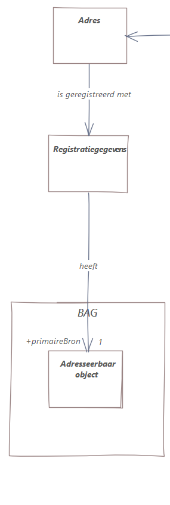

# Introduction

This document defines the "samenhangend model": an overarching information model describing the coherence, i.e. the relationships between object types from heterogeneous data sources which are published together in a single orchestrated dataset. 

The data sources are 
- Addresses and buildings (BAG) 
- Large scale topography (BGT)
- Small scale topography (BRT)
- Cadastral registry: only the Cadastral Map (BRK, only DKK)
- Underground: geology + soil (BRO)
- Underground infrastructure networks (IMKL)
- Administrative boundaries (DisGeo Bestuurlijke gebieden)
- Spatial plans (IMRO)

## Overarching coherent model: the basic idea

We will create a conceptual model and a logical model, both in UML, conformant to MIM 1.1. 

The conceptual model defines the concepts of our universe of discourse. It identifies the objects and their inherent relationships with other objects. In this conceptual model we will define relationships that should conceptually be there, even though they may not be present in the source datasets which were designed as silos.

This sketch of the conceptual model contains object types from BAG, BRK, and DiSGeo: 

An assumption is that we have access to the (logical) information models for all source datasets. These are created using modeling language UML. 

**Question**: How do we model the relationships between object types in source registries? We considered two options:  
- Create subclasses (UML specialisations) of the source classes and add the relationships between these subclasses. 
- Don't use the source models directly, but make copies of all object types that we need in the overarching model. We then add the relationships between these copy classes. 

We decided to go for the second option. In the case of subclasses, we would 'inherit' all properties of the superclasses, while we want only a selection of relevant properties. Also, conceptually we are not creating subclasses. What we actually want is to derive data from source data. We will model the dependency of our object types from source object types, using the PROV standard as a modeling pattern; but we will do this on the logical level, because there we are considering data. On the conceptual level we are only considering objects. 

Based on this conceptual model we will create a complete logical model. On this level we add data-registration concepts like history and provenance. That is, the logical model specifies how orchestrated data is mapped from source data. 

This is a simplified view of this inclusion of provenance: 

We are planning to introduce a generic modeling pattern on the MIM level (metamodel) for provenance that can be applied to map orchestrated data to source data. A first version of this was created as part of our first use case, [Adresses](https://geonovum.github.io/WaU-UC1/#EAID_18371C99_5129_4c39_8E20_83CED8FF19B9). 

