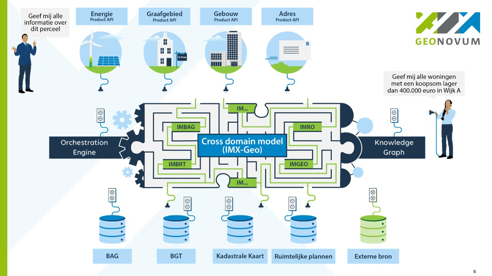

# Introduction

This document defines the Information model for cross-domain data queries - Geospatial (IMX-Geo): an overarching information model describing the relationships between object types from heterogeneous governmental data sources ("Base registries") for geospatial data. The goal is to support users in asking cross-registry questions. Based on the information model, the data can be served from the source registries on demand via orchestration mechanisms, using product API interfaces that cross source data boundaries; or it can be stored in a knowledge graph that conforms to the information model and queried as linked data. 

The cross-domain model has two major roles: 
- **Guide the way for people**: people who design product APIs or other products based on the orchestration endpoint, or who use the knowledge graph to find data, should be able to read IMX-Geo to understand what data is available, which objects are related to which, and how to navigate the paths through the data to assemble the data they want. 
- **Inform machines**: the orchestration engine should be able to read IMX-Geo to understand the relationships between objects and the navigation paths that exist through the data. E.g., IMX-Geo can keep the orchestration engine up to date if any changes in the underlying data sources occur. 

As seen in the image below, IMX-Geo sits in between the data sources, shown in the bottom, and the product APIs where users interact with the data:

<figure>
    
    <figcaption>Overview of how IMX-Geo is used</figcaption>
</figure>

The data sources are: 
- [Addresses and buildings (BAG)](https://www.kadaster.nl/zakelijk/registraties/basisregistraties/bag) 
- [Large scale topography (BGT)](https://www.kadaster.nl/zakelijk/registraties/basisregistraties/bgt)
- [Small scale topography (BRT)](https://www.kadaster.nl/zakelijk/registraties/basisregistraties/brt)
- Cadastral registry: only the Cadastral Map ([BRK](https://www.kadaster.nl/zakelijk/registraties/basisregistraties/brk), only [DKK](https://data.labs.kadaster.nl/brk/dkk))
- [Underground infrastructure networks (IMKL)](https://www.kadaster.nl/zakelijk/registraties/landelijke-voorzieningen/klic/klic-documentatie/officiele-versies-imkl-en-bmkl)
- [Spatial plans](https://www.kadaster.nl/zakelijk/registraties/landelijke-voorzieningen/ruimtelijke-plannen) ([IMRO](https://www.geonovum.nl/geo-standaarden/ro-standaarden-ruimtelijke-ordening/informatiemodel-ruimtelijke-ordening-imro2012))
- [Administrative boundaries](https://www.geonovum.nl/geo-standaarden/doorontwikkeling-in-samenhang-disgeo/bestuurlijke-gebieden) (DisGeo Bestuurlijke gebieden)
- Underground: [groundwater level](https://basisregistratieondergrond.nl/inhoud-bro/registratieobjecten/modellen/model-grondwaterspiegeldiepte-wdm/) + [soil](https://basisregistratieondergrond.nl/inhoud-bro/registratieobjecten/modellen/geotop-gtm/) (BRO)
